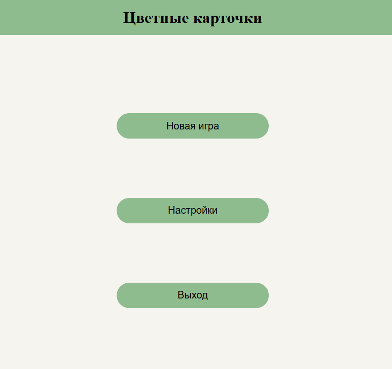

# 🃏 DoubleCards

## Описание проекта

**[DoubleCards](https://hambl.github.io/DoubleCards/)** - это простая карточная игра, в которой пользователю нужно запомнить пары карточек по цветам и найти их все среди перевернутых. Игра развивает память и внимательность, имеет гибкую настройку сложности и подходит как для детей, так и для взрослых.\
Проект представляет собой **динамическое веб-приложение (SPA)**, где вся верстка генерируется на лету с помощью JavaScript. Исключение составляет возможность подгружать верстку страницы с настройками с момошью шаблона `<template>`.

## Что изучалось в проекте
Этот проект был создан в учебных целях и позволил изучить и закрепить следующие темы:
- Основы HTML, CSS и JavaScript
- Работа с **DOM-деревом**, создание и управление элементами
- Организация структуры проекта, использование **модулей**
- Использование `LocalStorage` для сохранения настроек, выбранных пользователем

## Пример использования
1. Запустите игру по [ссылке](https://hambl.github.io/DoubleCards/) и нажмите кнопку **Новая игра**
2. Нажмите на кнопку **Показать карточки** и запомните все пары карточек по цветам за отведенное время
3. Выберите все пары карточек, кликнув по ним левой кнопкой мыши. Количество ошибок ограничено

Ограничения на количество уровней нет, а цвета карточек для каждого уровня генерируются случайным образом.\
Для изменения параметров количества карточек и таймера зайдите в **Настройки**. Также можно добавить подсказки в виде шестнадцатиричной подписи цветов на карточках.

## Превью

